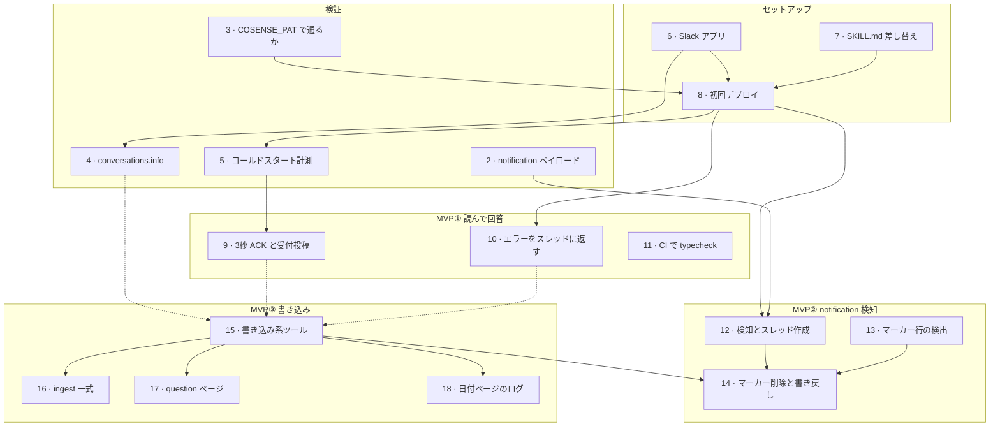

# ロードマップ

[issue 一覧](https://github.com/mpppk/slack-cosense-bot/issues)の依存関係。

仕様と決定事項の正本は Cosense のページ
[Cosense編集Slack bot](https://scrapbox.io/niboshi-tasks/Cosense編集Slack_bot) にある。
このファイルは **どの順に着手できるか** だけを持つ。タスクの中身は各 issue に書いてある。

## DAG



実線は**技術的な依存**（前段が終わらないと着手できない）。
破線は**判断のゲート**（技術的には着手できるが、意図的に待つ）。

## 依存の一覧

| issue | 直接の前提 | 理由 |
|---|---|---|
| [2](https://github.com/mpppk/slack-cosense-bot/issues/2) notification ペイロード | — | Slack 通知を 1 回流すだけ |
| [3](https://github.com/mpppk/slack-cosense-bot/issues/3) COSENSE_PAT | — | 手元の CLI で確かめられる |
| [6](https://github.com/mpppk/slack-cosense-bot/issues/6) Slack アプリ | — | |
| [7](https://github.com/mpppk/slack-cosense-bot/issues/7) SKILL.md 差し替え | — | |
| [11](https://github.com/mpppk/slack-cosense-bot/issues/11) CI | — | どの段階でも入れられる |
| [13](https://github.com/mpppk/slack-cosense-bot/issues/13) マーカー行の検出 | — | 純粋なテキスト解析。ユニットテストだけで完結する |
| [4](https://github.com/mpppk/slack-cosense-bot/issues/4) conversations.info | 6 | API を叩くのに bot token が要る |
| [8](https://github.com/mpppk/slack-cosense-bot/issues/8) 初回デプロイ | 3, 6, 7 | シークレット 4 つが揃い、prompts が実物になってから |
| [5](https://github.com/mpppk/slack-cosense-bot/issues/5) コールドスタート計測 | 8 | 本番のコンテナでないと測れない |
| [10](https://github.com/mpppk/slack-cosense-bot/issues/10) エラーをスレッドに返す | 8 | 実際に失敗させて切り分ける |
| [9](https://github.com/mpppk/slack-cosense-bot/issues/9) 3秒 ACK と受付投稿 | 5 | 待ち時間の実測値が設計の根拠になる |
| [12](https://github.com/mpppk/slack-cosense-bot/issues/12) 検知とスレッド作成 | 2, 8 | 2 が通らないと成立しない |
| [15](https://github.com/mpppk/slack-cosense-bot/issues/15) 書き込み系ツール | *4, 9, 10* | 下記のゲート |
| [14](https://github.com/mpppk/slack-cosense-bot/issues/14) マーカー削除と書き戻し | 12, 13, 15 | 検知・検出・書き込みが全部要る |
| [16](https://github.com/mpppk/slack-cosense-bot/issues/16) ingest 一式 | 15 | |
| [17](https://github.com/mpppk/slack-cosense-bot/issues/17) question ページ | 15 | |
| [18](https://github.com/mpppk/slack-cosense-bot/issues/18) 日付ページのログ | 15 | |

## クリティカルパス

```
3 / 6 / 7 → 8 → 5 → 9 → 15 → 14
```

6 段。先頭の 3・6・7 は互いに独立で、どれも 8 の前提なので、最長経路は 3 本ある。
並行して潰せば 1 本分の時間で済む。

**[8 初回デプロイ](https://github.com/mpppk/slack-cosense-bot/issues/8) がここに乗っている**ので、
デプロイが遅れるとその後が全部ずれる。

## 2 つのブロッカー

### [2 notification ペイロード](https://github.com/mpppk/slack-cosense-bot/issues/2)

クリティカルパスには乗っていないが、**MVP② 全体（12・13・14）の成否がここで決まる。**
Cosense の通知は bot の投稿なので、Chat SDK / Think が bot 投稿を既定で無視するなら
そもそも検知できない。仕様の中核が丸ごと組み直しになるので、**着手順に関わらず最初に確かめる。**

### [15 書き込み系ツール](https://github.com/mpppk/slack-cosense-bot/issues/15) のゲート

技術的には 8 の直後に着手できる。意図的に MVP①（4・9・10）の後ろに置いてある。

無承認で即時反映する設計なので、型の取り違え・Infobox キーの揺れ・`📄` / `🔖` の付け忘れが
そのまま本番の wiki に入る。約 58KB の AGENTS.md を system prompt で渡した
`z-ai/glm-5.3-flash` がどれだけ規約を守れるかを、**読み取りだけの運用で先に測る。**

このゲートを外すかどうかは、MVP① を実際に使ってみてから判断する。

## 並行して進められる塊

着手可能なものが常に複数ある。手が空いたらこの順で拾う。

1. **今すぐ**: 2 / 3 / 6 / 7 / 11 / 13
2. **6 の後**: 4
3. **3・6・7 の後**: 8 → その後 5 / 10 / 12
